

<picture>
  <source media="(prefers-color-scheme: light)" srcset="docs/hero-light.png">
  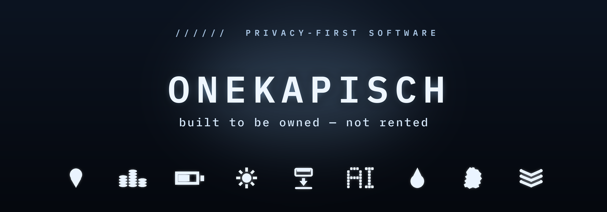
</picture>

<b>Privacy-first software, built to be owned, not rented.</b>

<code>local-first</code> · <code>no telemetry</code> · <code>no ads</code> · <code>nothing sold, ever</code>

---

A one-person studio out of Munich. By day, an **Enterprise AI Architect at Siemens Healthineers**. By night, I ship small, sharp, private tools: local-first software that respects the people who use it: no accounts, no tracking, no subscription traps.

**→ Experience the whole fleet at [onekapisch.com](https://onekapisch.com)**: a curated WebGL world where one swarm of ice cubes becomes a planet, shatters mid-air, and reassembles into every app icon. (~230 cubes, one GPU draw call, real spring physics, ice refracting light at its true index of refraction, 1.31.)

### ❄️ The fleet, built to be owned

<!-- ===== clickable bento · GENERATED by build_readme.mjs, do not hand-edit ===== -->

<a href="https://www.skylocation.app">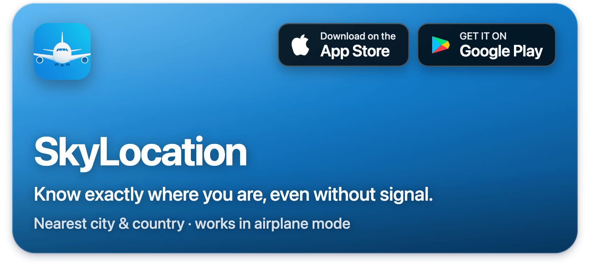</a><a href="https://www.tokens4breakfast.app">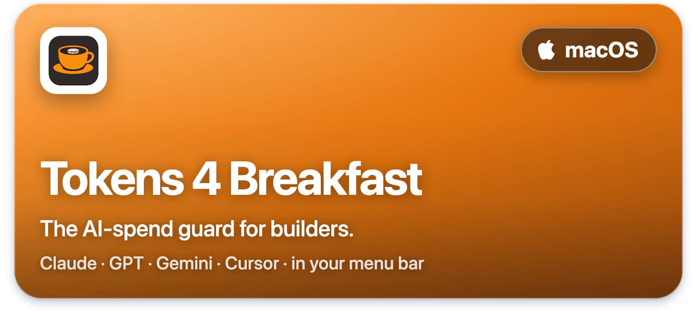</a>

<a href="https://www.mac4breakfast.app">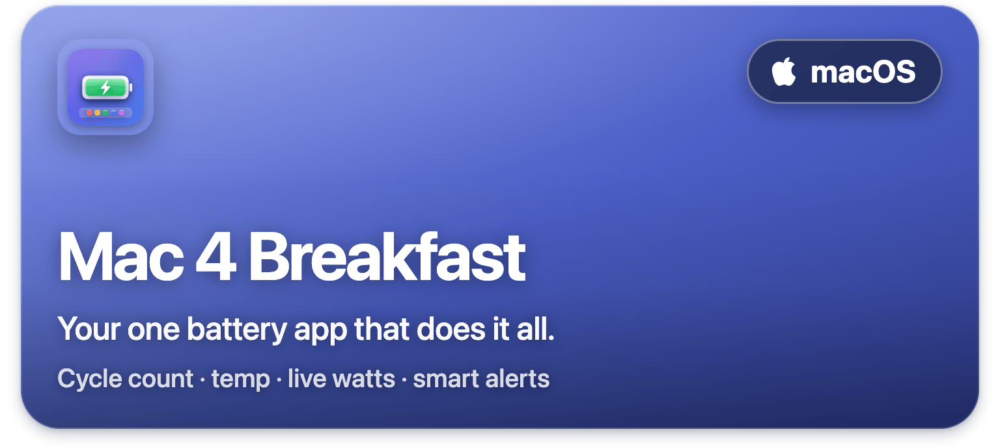</a><a href="https://getlumel.app">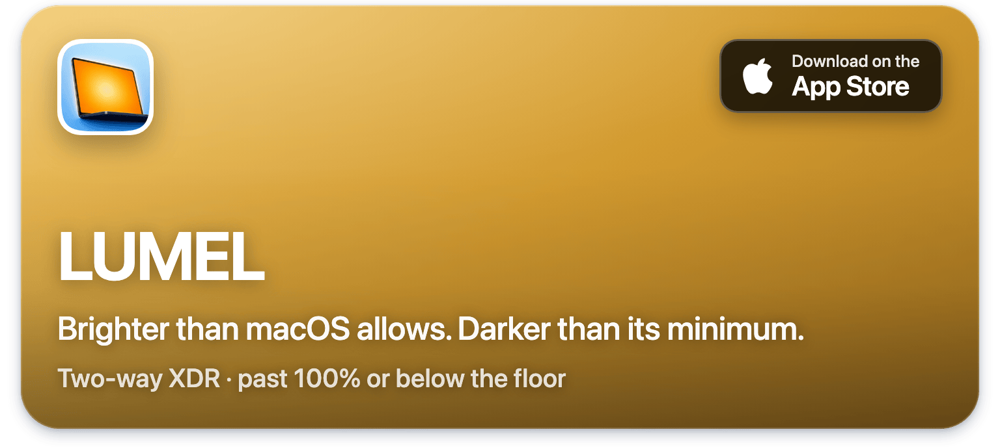</a>

<a href="https://github.com/onekapisch/easy-write">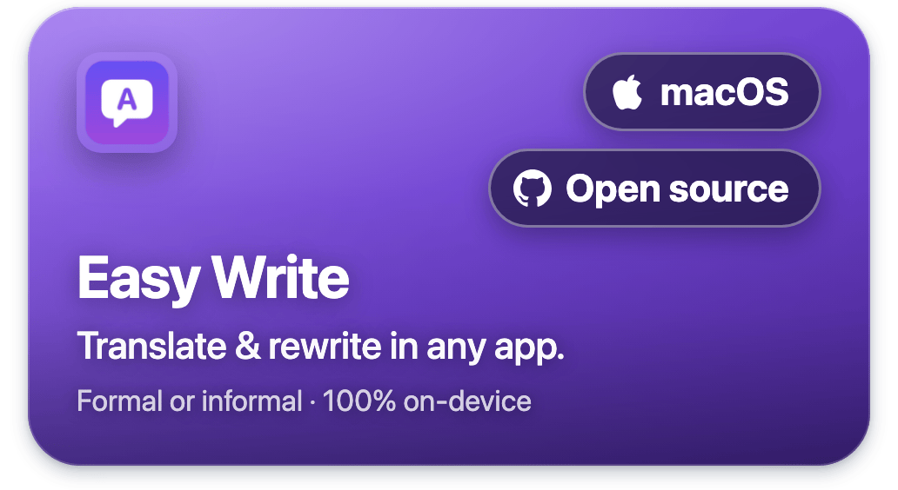</a><a href="https://github.com/onekapisch/macOS-Minimizer">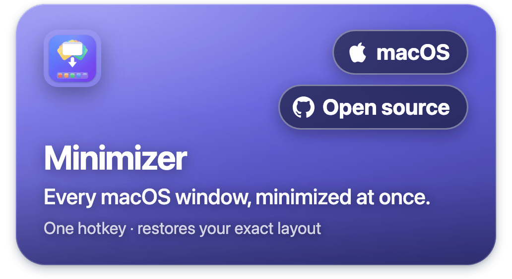</a><a href="https://github.com/onekapisch/chime-4-breakfast">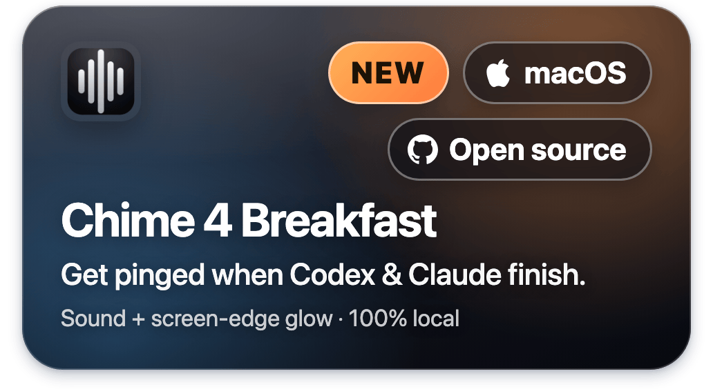</a>

<a href="https://github.com/onekapisch/Unfold-AI">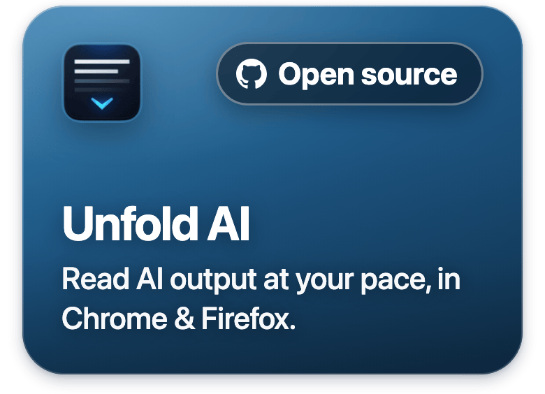</a><a href="https://tankalert.de">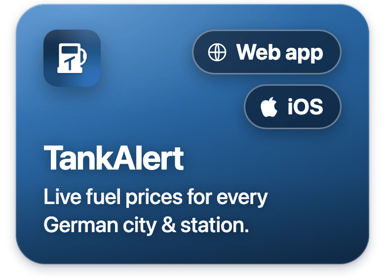</a><a href="https://tminusai.com">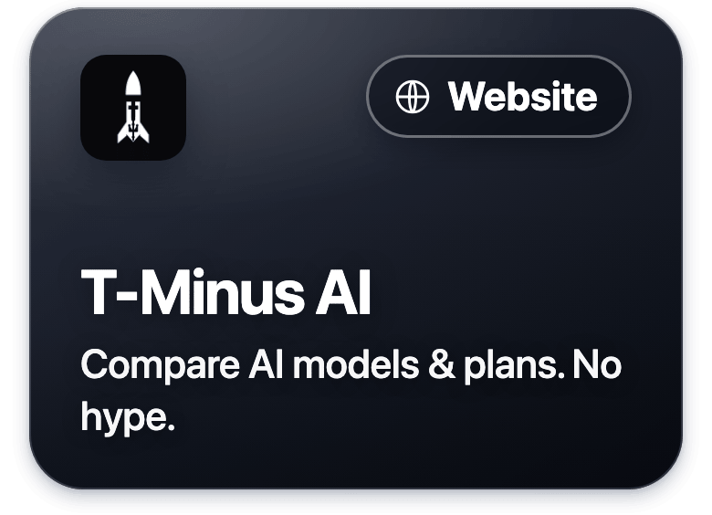</a>

Every tile is clickable → SkyLocation · Tokens 4 Breakfast · Mac 4 Breakfast · LUMEL · Easy Write · Minimizer · Chime 4 Breakfast · Unfold AI · Life Hacks Germany · TankAlert · T-Minus AI. Consumer apps open their site; open-source apps open their repo.
<!-- ===== /clickable bento ===== -->

### 🛠 How I build
Local-first by default. No account unless you truly need one. Nothing sold to brokers, no ads, no growth hacks hiding in the work. Buy once, own it. I'd rather ship one honest tool than ten that rent your attention.

### ⚙️ Stack
`Swift / SwiftUI` · `TypeScript / React` · `vanilla JS + WebGL (Three.js)` · `Node` · `Vercel`

### 🤝 Find me
[onekapisch.com](https://onekapisch.com) · [X](https://x.com/onekapisch) · [Threads](https://www.threads.com/@kapisch_ai) · [Bluesky](https://bsky.app/profile/onekapisch.com) · `kapisch@icloud.com`

 ⭐ If one of these saved you time, a star on the open-source ones means a lot.

